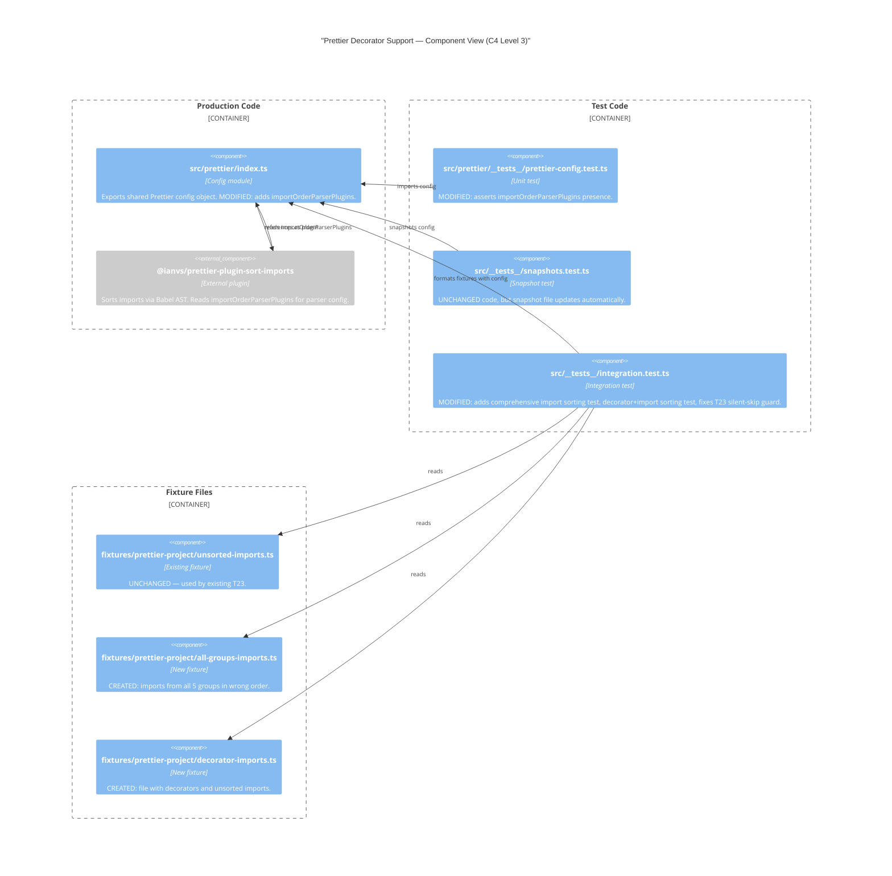
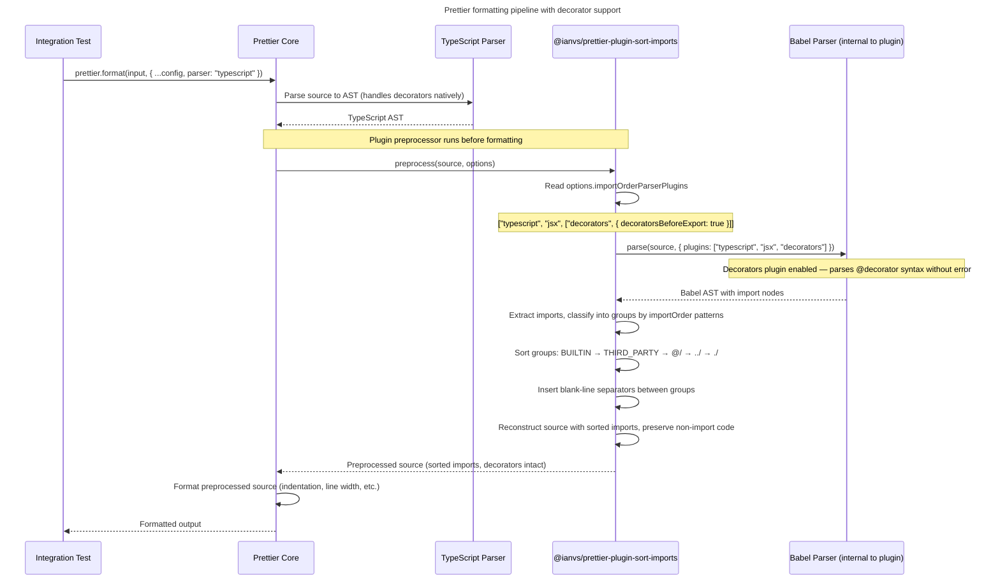

# Architecture

## 1. Component Diagram

The change affects one production module and several test/fixture files. The diagram shows the Prettier config module, the import sorting plugin (external dependency), and the test/fixture files that change.

## 2. Change Inventory

### Production files (modified)

| File | Change |
|------|--------|
| `@/src/prettier/index.ts` | Add `importOrderParserPlugins: ["typescript", "jsx", '["decorators", { "decoratorsBeforeExport": true }]']` to the config object. |

### Test files (modified)

| File | Change |
|------|--------|
| `@/src/prettier/__tests__/prettier-config.test.ts` | Add assertion for `importOrderParserPlugins` presence and content. |
| `@/src/__tests__/integration.test.ts` | Add two new test cases (comprehensive import sorting, decorator+import sorting). Fix T23 silent-skip guard. |
| `@/src/__tests__/__snapshots__/snapshots.test.ts.snap` | Auto-updated by Vitest on next run — new snapshot includes `importOrderParserPlugins` key. |

### Fixture files (created)

| File | Description |
|------|-------------|
| `@/src/__tests__/fixtures/prettier-project/all-groups-imports.ts` | Imports from all 5 configured groups in wrong order. Used by comprehensive import sorting test. |
| `@/src/__tests__/fixtures/prettier-project/decorator-imports.ts` | File with TC39 decorators and unsorted imports. Used by decorator+import sorting test. |

**Total**: 1 production file modified, 2 test files modified, 1 snapshot auto-updated, 2 fixture files created.

## 3. Module Boundaries

- **Production boundary**: Only `src/prettier/index.ts` changes. The exported `Config` type is unchanged — `importOrderParserPlugins` is part of the plugin's option namespace, which Prettier passes through to the plugin. No new dependency is added.
- **Test boundary**: All other changes are test-only. New fixtures are placed in the existing `src/__tests__/fixtures/prettier-project/` directory, following the established convention [ref: [../01-research/01-codebase-analysis.md#9-fixture-files--prettier-project](../01-research/01-codebase-analysis.md#9-fixture-files--prettier-project)].
- **No cross-module impact**: ESLint, Vitest, TypeScript, and CLI configurations are unaffected. The `tsconfig.base.json` is not modified (TC39 stage 3 decorators work in TS 5.0+ without flags) [ref: [../01-research/03-open-questions.md#q6](../01-research/03-open-questions.md#q6)].

## 4. Data Flow: Prettier + Import Sorting Plugin with Decorators

This sequence diagram shows how Prettier processes a file containing both decorators and unsorted imports when `importOrderParserPlugins` includes `"decorators"`.

**Key insight**: Without `importOrderParserPlugins` including `"decorators"`, the Babel parse step (inside the sort plugin) throws `SyntaxError` on decorator syntax — even though Prettier's own TypeScript parser handles decorators fine. The config change fixes only the plugin's internal Babel parse [ref: [../01-research/02-external-research.md#2-import-sorting-plugins-use-babel-internally](../01-research/02-external-research.md#2-import-sorting-plugins-use-babel-internally)].
