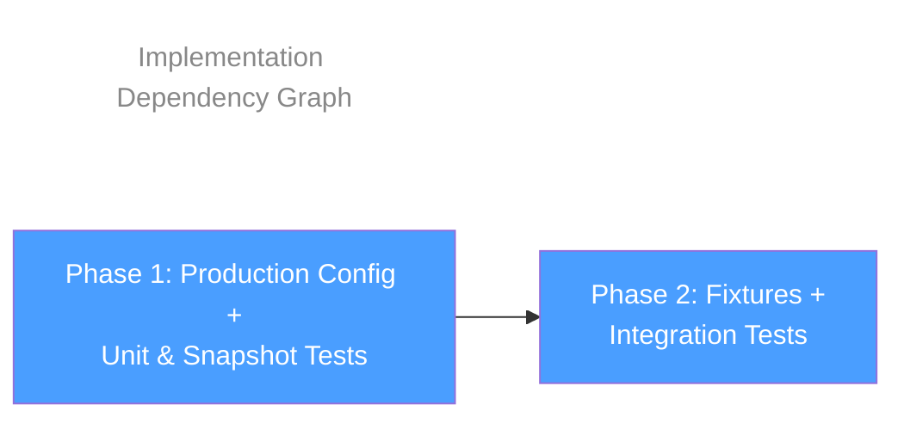

## Overview

Two-phase implementation plan for adding `importOrderParserPlugins` with TC39 stage 3 decorator support to the shared Prettier config, extending import sorting test coverage to all 5 configured groups, fixing the T23 silent-skip guard, and updating unit/snapshot tests. Phase 1 delivers the production config change with its unit and snapshot test updates. Phase 2 creates fixture files and adds/modifies integration tests.

## Phase Map

## Phase Summary

| Phase | Name | Type | Dependencies | Complexity | Files |
|-------|------|------|--------------|------------|-------|
| 1 | Production Config + Unit & Snapshot Tests | Sequential | None | Low | `src/prettier/index.ts`, `src/prettier/__tests__/prettier-config.test.ts`, `src/__tests__/__snapshots__/snapshots.test.ts.snap` |
| 2 | Fixtures + Integration Tests | Sequential | Phase 1 | Medium | `src/__tests__/fixtures/prettier-project/all-groups-imports.ts`, `src/__tests__/fixtures/prettier-project/decorator-imports.ts`, `src/__tests__/integration.test.ts` |

## Execution Rules

- Phase 2 depends on Phase 1 — the production config change (`importOrderParserPlugins`) must be in place before T34 (decorator + import sorting test) can pass.
- Both phases are sequential — Phase 1 must be verified before Phase 2 begins.
- Each phase must leave the project in a compilable state (`npm run ts-check` passes).
- A baseline test run (`npx vitest run`) must be performed before Phase 1 changes to establish current test state per R7 mitigation.

## Next Steps

Proceeds to implementation after human review.

## Quality Review

### Checklist

| # | Criterion | Status | Notes |
|---|-----------|--------|-------|
| 1 | Every design component mapped to task(s) | PASS | All 6 items from architecture §2 Change Inventory are covered: `src/prettier/index.ts` → Task 1.2, `prettier-config.test.ts` → Task 1.3, `integration.test.ts` → Task 2.3, `snapshots.test.ts.snap` → Task 1.4, `all-groups-imports.ts` → Task 2.1, `decorator-imports.ts` → Task 2.2 |
| 2 | File paths concrete and verified | PASS | All paths verified against repository: `src/prettier/index.ts`, `src/prettier/__tests__/prettier-config.test.ts`, `src/__tests__/integration.test.ts`, `src/__tests__/__snapshots__/snapshots.test.ts.snap`, `src/__tests__/fixtures/prettier-project/` (directory exists for new fixtures) |
| 3 | Phase dependencies correct | PASS | Phase 2 depends on Phase 1 (config change needed for T34). No circular dependencies. No missing dependencies. |
| 4 | Verification criteria per phase | PASS | Phase 1: 3 criteria (ts-check, vitest, snapshot diff review). Phase 2: 6 criteria (ts-check, vitest, T23 code review, T33 group validation, T34 decorator validation, optional negative verification). |
| 5 | Each phase leaves project compilable | PASS | Both phases explicitly require `npm run ts-check` passing as first verification criterion. |
| 6 | No vague tasks — exact files and changes | PASS | All tasks specify exact file paths, exact property names/values, exact assertion code patterns, and exact guard replacement code. |
| 7 | Design traceability (`[ref: ...]`) on all tasks | PASS | All 7 tasks have `[ref: ...]` links to design documents: Task 1.1 → R7, Task 1.2 → architecture §2 + ADR-1/2/3, Task 1.3 → T6, Task 1.4 → T16 + R1, Task 2.1 → ADR-4/7 + T33, Task 2.2 → ADR-1/6/7 + T34, Task 2.3 → ADR-8 + T23/ADR-4/5 + T33/ADR-6 + T34. |
| 8 | Parallel/sequential correctly marked | PASS | Both phases marked sequential (correct). Tasks 2.1 and 2.2 (fixture creation) could technically be parallelized, but marking them sequential is conservative and not incorrect. |
| 9 | Complexity estimates present (L/M/H) | FAIL | Phase-level complexity is in the summary table (Low/Medium), but individual tasks lack per-task complexity estimates. |
| 10 | Documentation tasks proportional to existing docs/demos | N/A | No documentation tasks in the plan. `docs/` contains only `CHANGELOG.md`; no `apps/demos/` directory exists. Correct omission. |
| 11 | Mermaid dependency graph present | PASS | Present in README.md § Phase Map — graph shows P1 → P2 linear dependency. |
| 12 | Phase summary table complete | PASS | Table includes Phase, Name, Type, Dependencies, Complexity, and Files columns for both phases. |

### Additional Criteria

| # | Criterion | Status | Notes |
|---|-----------|--------|-------|
| 13 | All 5 test cases from `06-testcases.md` covered | PASS | T6 mod → Task 1.3, T16 mod → Task 1.4, T23 mod → Task 2.3, T33 new → Task 2.3, T34 new → Task 2.3 |
| 14 | Risk mitigations reflected (R3, R7) | PASS | R7 (baseline test run) → Task 1.1 with explicit instructions. R3 (T23 guard fix ordering) → Task 2.3 lists the guard fix first in its details section, and Phase 1 dependency ensures config is in place. |

### Documentation Proportionality

N/A — no documentation or example tasks in the plan. The project's `docs/` contains only `CHANGELOG.md` and no `apps/demos/` directory exists. The plan correctly omits documentation tasks, consistent with the design's non-goals (no external API changes).

### Issues Found

1. **Missing per-task complexity estimates**
   - **What's wrong**: The phase summary table has phase-level complexity (Low/Medium), but individual tasks (1.1–1.4, 2.1–2.3) do not have complexity estimates (Low/Medium/High).
   - **Where**: `01-phase.md` Tasks 1.1–1.4, `02-phase.md` Tasks 2.1–2.3
   - **What's expected**: Each task should have a complexity label (e.g., Task 1.1: Low, Task 1.2: Low, Task 2.3: Medium).
   - **Severity**: Low — phase-level estimates are present and sufficient for planning; per-task estimates are refinement detail.
