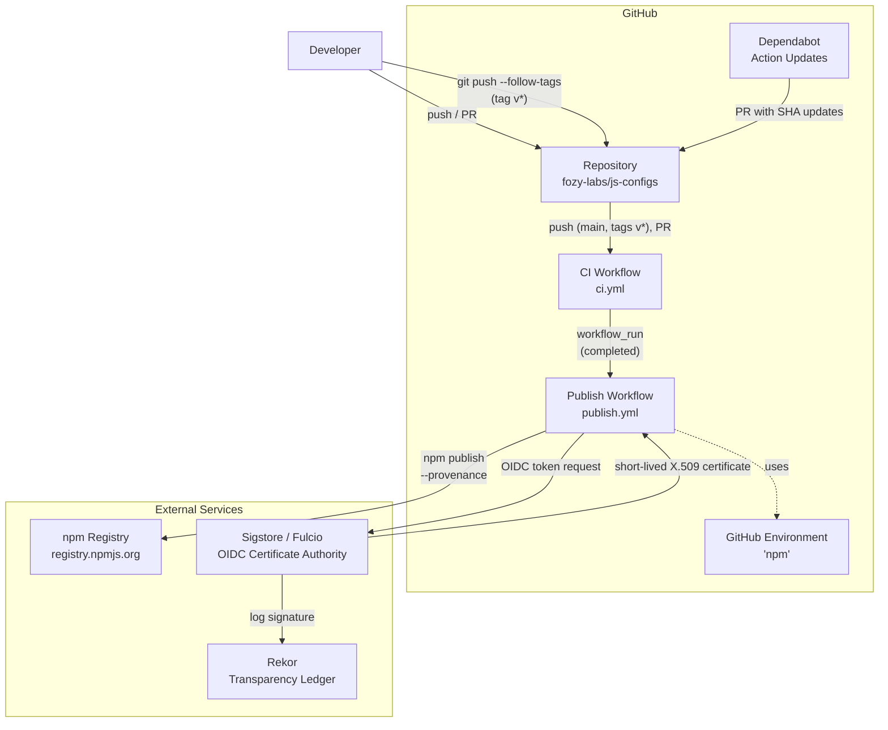
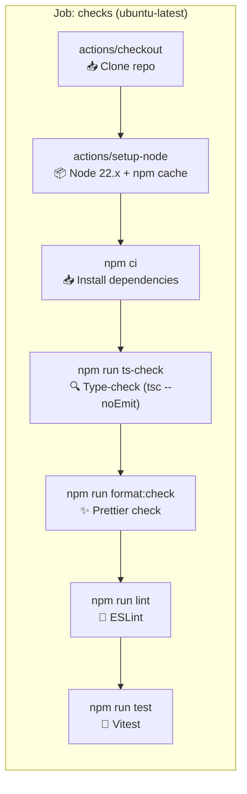
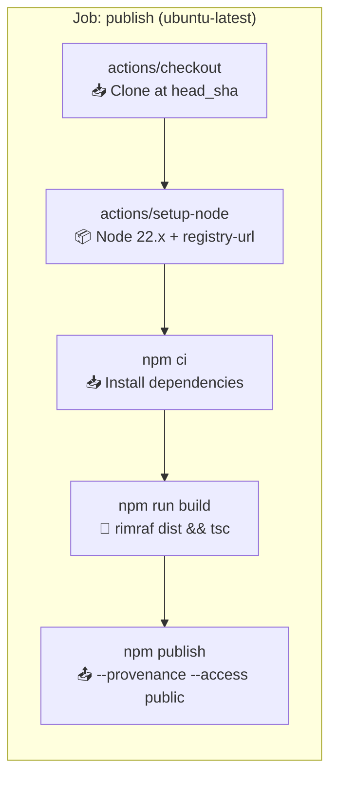
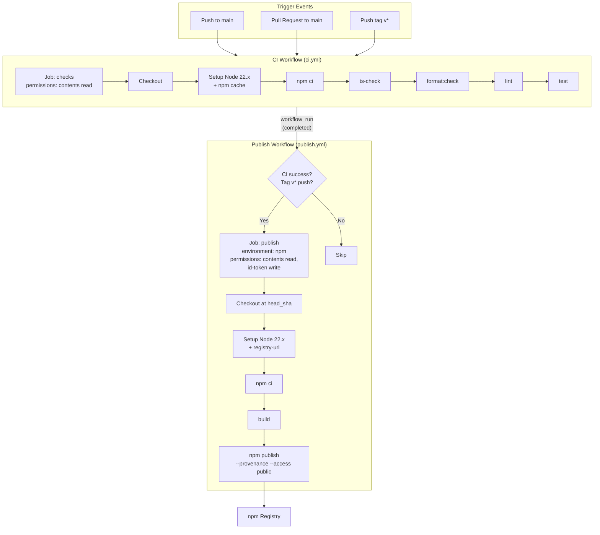

# CI/CD Pipeline Architecture

## 1. System Overview

The CI/CD pipeline for `@fozy-labs/js-configs` consists of two GitHub Actions workflows connected via `workflow_run`, interacting with the npm registry through OIDC-based trusted publishing. The repository currently has no CI/CD infrastructure — all workflow files, dependabot configuration, and `package.json` changes are new additions [ref: [codebase analysis](../01-research/01-codebase-analysis.md#6-existing-ci-artifacts)].

All build/test/lint scripts are already defined in `package.json` and require no modifications [ref: [codebase analysis](../01-research/01-codebase-analysis.md#1-build-pipeline)].

### C4 Context Diagram



## 2. File Structure

### New Files

| File | Purpose |
|------|---------|
| `.github/workflows/ci.yml` | CI checks: type-check, format, lint, test |
| `.github/workflows/publish.yml` | Build and publish to npm with provenance |
| `.github/dependabot.yml` | Auto-update GitHub Actions versions (SHA pins) |

### Modified Files

| File | Change | Rationale |
|------|--------|-----------|
| `package.json` | Add `engines` field | Declare Node.js >=22.0.0 requirement [ref: [open questions Q7](../01-research/03-open-questions.md#q7-нужно-ли-добавить-поле-engines-в-packagejson)] |

## 3. CI Workflow (`ci.yml`)

### Triggers

| Event | Filter | Purpose |
|-------|--------|---------|
| `push` | `branches: [main]` | Validate code merged to main |
| `push` | `tags: ['v*']` | Run checks before publish (enables workflow_run chain) |
| `pull_request` | `branches: [main]` | Validate PR code before merge |

The `tags: ['v*']` trigger on CI is essential for the `workflow_run` connection — publish workflow depends on CI completing for tag pushes.

### Permissions

```yaml
permissions:
  contents: read
```

Minimal permissions — CI only needs to read source code [ref: [external research §7](../01-research/02-external-research.md#7-security-best-practices)].

### Job: `checks`

Single job running all CI checks sequentially. No matrix — single Node.js 22.x version [ref: [open questions Q4](../01-research/03-open-questions.md#q4-nodejs-version--какую-версию-использовать-в-ci-и-для-публикации)].



#### Steps Detail

| # | Step | Command / Action | Notes |
|---|------|-----------------|-------|
| 1 | Checkout | `actions/checkout@<SHA>` | SHA-pinned |
| 2 | Setup Node | `actions/setup-node@<SHA>` | `node-version: '22.x'`, `cache: 'npm'` — uses built-in npm cache [ref: [external research §8](../01-research/02-external-research.md#8-caching)] |
| 3 | Install | `npm ci` | Deterministic install from lockfile [ref: [codebase analysis §6](../01-research/01-codebase-analysis.md#6-existing-ci-artifacts) — `package-lock.json` exists] |
| 4 | Type-check | `npm run ts-check` | `tsc --noEmit` via `tsconfig.json` [ref: [codebase analysis §2](../01-research/01-codebase-analysis.md#2-test-pipeline)] |
| 5 | Format check | `npm run format:check` | `prettier --check src/` [ref: [codebase analysis §3](../01-research/01-codebase-analysis.md#3-lint-and-format)] |
| 6 | Lint | `npm run lint` | `eslint src/` [ref: [codebase analysis §3](../01-research/01-codebase-analysis.md#3-lint-and-format)] |
| 7 | Test | `npm run test` | `vitest run` [ref: [codebase analysis §2](../01-research/01-codebase-analysis.md#2-test-pipeline)] |

**Design note**: `build` is intentionally excluded from CI — `ts-check` (`tsc --noEmit`) catches the same type errors without generating artifacts. Full build runs only in the publish workflow [ref: user decision — "build только в publish job"].

## 4. Publish Workflow (`publish.yml`)

### Trigger

```yaml
on:
  workflow_run:
    workflows: ["CI"]
    types: [completed]
```

The publish workflow triggers when the CI workflow completes. The job-level `if` condition gates execution to only successful CI runs triggered by tag pushes.

### Job Condition

```yaml
if: >-
  github.event.workflow_run.conclusion == 'success' &&
  startsWith(github.event.workflow_run.head_branch, 'v')
```

- `conclusion == 'success'` — ensures all CI checks passed
- `startsWith(head_branch, 'v')` — ensures this was triggered by a `v*` tag push, not a branch push

### workflow_run Context Considerations

In `workflow_run` context, `github.sha` and `github.ref` refer to the **default branch** (main), not the tagged commit. The publish job must:

1. Checkout the tagged commit using `github.event.workflow_run.head_sha`
2. Extract the tag name from `github.event.workflow_run.head_branch`

### Environment

GitHub Environment: `npm` — used for OIDC trusted publishing configuration on npmjs.com. The environment name must match what is configured in npm's trusted publisher settings [ref: [external research §7](../01-research/02-external-research.md#7-security-best-practices)].

### Permissions

```yaml
permissions:
  contents: read    # checkout source code
  id-token: write   # mint OIDC token for Sigstore signing and npm trusted publishing
```

`id-token: write` is required for both provenance attestation (Sigstore) and OIDC authentication with npm [ref: [external research §1](../01-research/02-external-research.md#1-npm-provenance-and-oidc)].

### Job: `publish`



#### Steps Detail

| # | Step | Command / Action | Notes |
|---|------|-----------------|-------|
| 1 | Checkout | `actions/checkout@<SHA>` | `ref: ${{ github.event.workflow_run.head_sha }}` — checkout tagged commit |
| 2 | Setup Node | `actions/setup-node@<SHA>` | `node-version: '22.x'`, `registry-url: 'https://registry.npmjs.org'` — configures `.npmrc` for npm registry |
| 3 | Install | `npm ci` | Deterministic install from lockfile |
| 4 | Build | `npm run build` | `rimraf dist && tsc` — compiles TypeScript to `dist/` [ref: [codebase analysis §1](../01-research/01-codebase-analysis.md#1-build-pipeline)] |
| 5 | Publish | `npm publish --provenance --access public` | OIDC auth (no `NODE_AUTH_TOKEN` needed); provenance via Sigstore; `--access public` for scoped package [ref: [external research §5](../01-research/02-external-research.md#5-scoped-package-publishing)] |

**Important**: No `NODE_AUTH_TOKEN` environment variable is set — npm CLI 11.5.1+ (shipped with Node 22.14.0+) auto-detects the GitHub Actions OIDC environment and handles token exchange automatically [ref: [external research §2](../01-research/02-external-research.md#2-authentication-methods)].

**Note**: `--access public` is technically redundant since `publishConfig.access: "public"` already exists in `package.json` [ref: [codebase analysis §4](../01-research/01-codebase-analysis.md#4-package-metadata)], but including it as a safety measure is acceptable.

## 5. package.json Changes

### `engines` Field

```json
"engines": {
  "node": ">=22.0.0"
}
```

Added to declare the minimum supported Node.js version. This aligns with:
- CI test environment (Node 22.x)
- npm trusted publishing requirement (Node 22.14.0+) [ref: [external research §2](../01-research/02-external-research.md#2-authentication-methods)]
- Node.js 20.x reaching EOL in April 2026 [ref: [external research §4](../01-research/02-external-research.md#4-ci-matrix-strategy)]

The value `>=22.0.0` (not `>=22.14.0`) allows any 22.x version for consumers, since the 22.14.0+ requirement only applies to the CI publish step.

## 6. Dependabot Configuration

`.github/dependabot.yml` — auto-updates GitHub Actions SHA-pinned versions:

```yaml
version: 2
updates:
  - package-ecosystem: "github-actions"
    directory: "/"
    schedule:
      interval: "weekly"
```

This creates automated PRs when new action versions are available, updating the pinned SHA values [ref: [external research §7 item 3](../01-research/02-external-research.md#7-security-best-practices)].

Scope is limited to `github-actions` ecosystem only — npm dependencies are managed separately.

## 7. Security Model

### SHA Pinning

All third-party actions are pinned to full-length commit SHAs with version comments:

```yaml
- uses: actions/checkout@<full-sha>  # v4.x.x
- uses: actions/setup-node@<full-sha>  # v4.x.x
```

This prevents supply chain attacks via tag mutation. Dependabot keeps pins updated via automated PRs [ref: [external research §7 items 2–3](../01-research/02-external-research.md#7-security-best-practices)].

Actual SHA values will be resolved during the implementation phase using the latest stable versions at that time.

### Permissions Model

| Workflow | `contents` | `id-token` | Rationale |
|----------|-----------|------------|-----------|
| CI | `read` | — | Only reads source code |
| Publish | `read` | `write` | Reads source + mints OIDC token for Sigstore + npm auth |

Permissions are set at the **job level**, not workflow level, following the principle of least privilege [ref: [external research §7 item 1](../01-research/02-external-research.md#7-security-best-practices)].

### OIDC Trusted Publishing

Authentication flow for `npm publish`:

1. GitHub Actions mints an OIDC token containing the workflow identity (repo, workflow, environment, ref)
2. npm CLI 11.5.1+ detects the OIDC environment automatically
3. npm exchanges the OIDC token with the registry for a short-lived publish token
4. For provenance: Sigstore's Fulcio CA issues an X.509 certificate bound to the OIDC identity
5. The package is signed and the signature is logged in Rekor (transparency ledger)

**Prerequisite**: The package must already exist on npm, and the trusted publisher must be configured in npm package settings (repo: `fozy-labs/js-configs`, workflow: `publish.yml`, environment: `npm`) [ref: [external research §2](../01-research/02-external-research.md#2-authentication-methods)].

### GitHub Environment: `npm`

A GitHub Environment named `npm` is required for trusted publishing. npm validates that the OIDC token includes the expected environment name. The environment provides:

- Namespace for trusted publishing configuration matching
- Optional: deployment protection rules (approval gates) — not configured initially, can be added later
- Audit trail of deployments

### First Publish Constraint

The very first publish (`v0.1.0`) cannot use OIDC — the package must exist on npm before trusted publishing can be configured. The first publish is performed manually with a granular access token [ref: [external research, Pitfalls §5](../01-research/02-external-research.md#pitfalls)].

## 8. Complete Workflow Interaction


