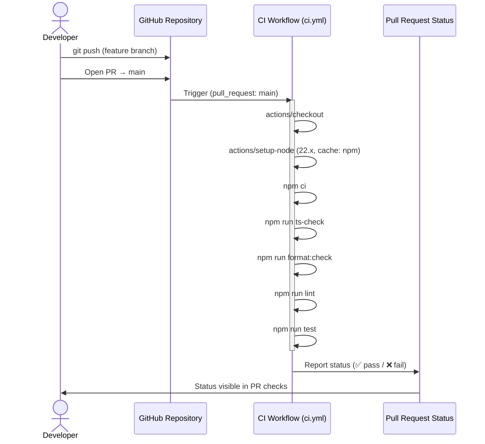
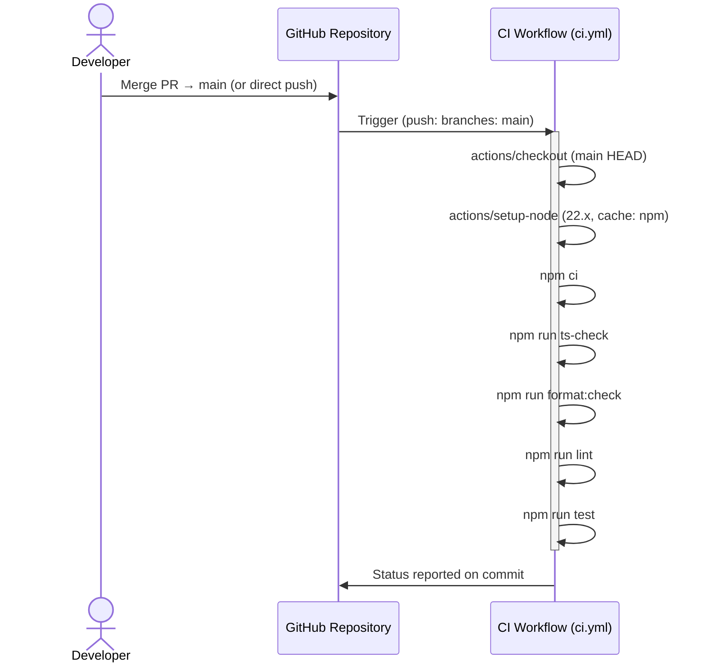
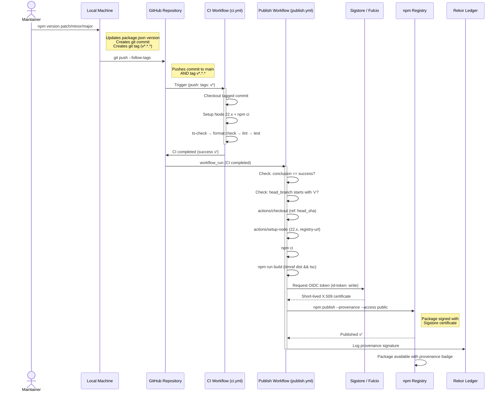
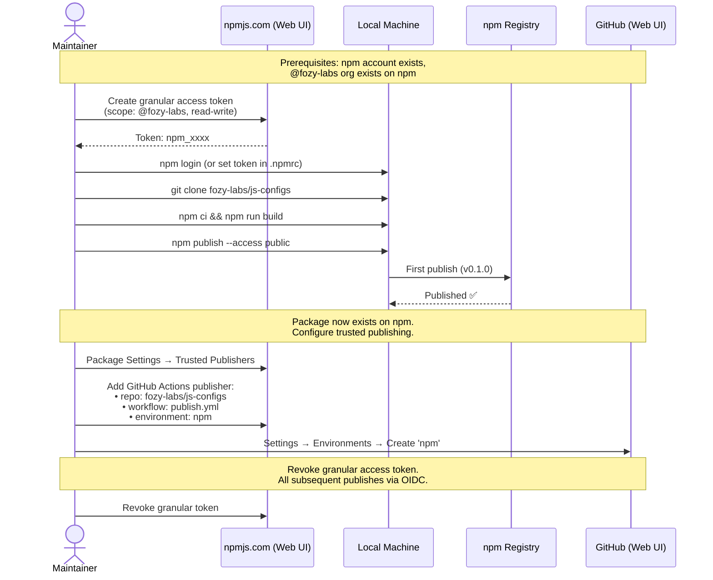
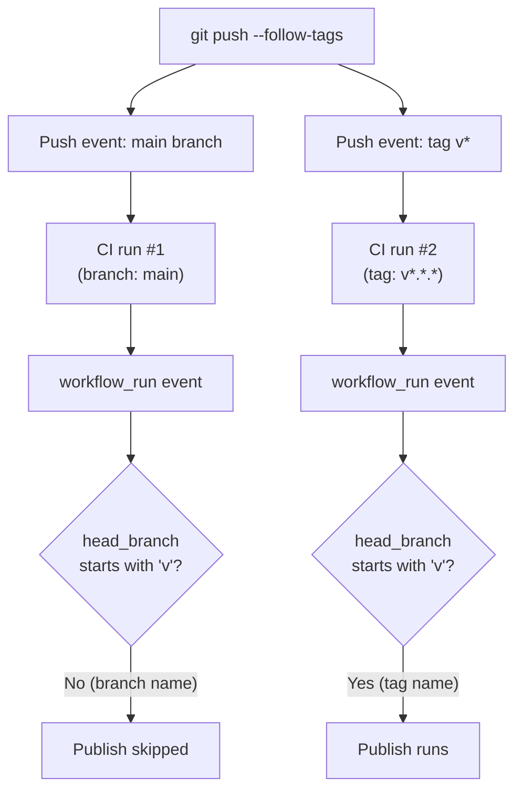

# CI/CD Data Flow

## 1. PR Flow

A developer pushes a branch or opens a pull request targeting `main`. CI runs all checks and reports status back to the PR.

**Trigger**: `pull_request` event targeting `main` branch.

**Data flow**: Source code → checkout → dependency install (from `package-lock.json` cache) → sequential check pipeline → status check result.

**Edge cases**:
- If `npm ci` fails (lockfile mismatch), all subsequent steps are skipped
- Each step depends on previous step — failure stops the pipeline
- PR from fork: CI runs with read-only permissions (no secret access)

## 2. Merge to Main Flow

When a PR is merged (or a direct push to `main`), CI runs the same checks as a validation gate.

**Trigger**: `push` event on `main` branch.

**Data flow**: Identical to PR flow, but runs against the merged commit on `main`. This serves as a post-merge validation — important because merge commits can introduce issues not caught in individual PR checks.

**Note**: This workflow run does NOT trigger publish — the `workflow_run` condition in `publish.yml` filters for tag pushes only (`startsWith(head_branch, 'v')`).

## 3. Release Flow

The primary release scenario: maintainer bumps version, pushes tag, CI runs checks, and publish workflow builds and publishes to npm.

**Trigger chain**: Tag push → CI (push: tags) → workflow_run → Publish.

**Data flow**:
1. `npm version` modifies `package.json` version, creates commit + tag locally
2. `git push --follow-tags` pushes both commit and tag to remote
3. Tag push triggers CI workflow — checks run against the tagged commit
4. CI completion fires `workflow_run` event
5. Publish workflow validates: CI passed + tag push
6. Checkout uses `github.event.workflow_run.head_sha` (the tagged commit, not main HEAD)
7. Build compiles TypeScript to `dist/` [ref: [codebase analysis §1](../01-research/01-codebase-analysis.md#1-build-pipeline)]
8. npm CLI auto-detects OIDC environment, exchanges token with npm registry [ref: [external research §2](../01-research/02-external-research.md#2-authentication-methods)]
9. Sigstore signs the package, logs to Rekor transparency ledger [ref: [external research §1](../01-research/02-external-research.md#1-npm-provenance-and-oidc)]

**Edge cases**:
- CI fails on tag push → publish workflow fires but `conclusion != 'success'` → job skipped
- Tag pushed from non-main branch → CI runs, publish runs (no branch filter on tag pushes). Maintainer discipline required.
- npm version already exists → `npm publish` fails with `403 - version already exists`
- OIDC token minting fails → publish step fails, no partial publish risk (npm is atomic)

## 4. First Publish Flow (One-Time Setup)

The initial package publish cannot use OIDC — the package must exist on npm before trusted publishing can be configured [ref: [external research, Pitfalls §5](../01-research/02-external-research.md#pitfalls)].

**Data flow**: Manual, one-time process performed outside of CI.

**Steps**:
1. Create a granular access token on npm with write access to `@fozy-labs` scope
2. Build locally: `npm ci && npm run build`
3. Publish manually: `npm publish --access public` (no `--provenance` — not needed for first publish)
4. Configure trusted publisher on npm: link `fozy-labs/js-configs` repo, `publish.yml` workflow, `npm` environment
5. Create GitHub Environment `npm` in repository settings
6. Revoke the granular token — no longer needed after OIDC is configured

**Edge cases**:
- Forgot `--access public` → npm returns error for scoped package (though `publishConfig.access: "public"` in `package.json` handles this [ref: [codebase analysis §4](../01-research/01-codebase-analysis.md#4-package-metadata)])
- `repository` field mismatch in `package.json` → provenance will fail later (case-sensitive) [ref: [external research, Pitfalls §2](../01-research/02-external-research.md#pitfalls)]. Currently set to `git+https://github.com/fozy-labs/js-configs.git` [ref: [codebase analysis §4](../01-research/01-codebase-analysis.md#4-package-metadata)]

## 5. Parallel Push Scenario

When `git push --follow-tags` is executed, GitHub receives both the commit push (to main) and the tag push simultaneously. This results in two CI workflow runs:

**Key observation**: Two CI runs trigger two `workflow_run` events. The job condition `startsWith(head_branch, 'v')` ensures only the tag-triggered run proceeds to publish. The branch-triggered run's `workflow_run` is filtered out.

This is expected behavior, not a bug. The extra CI run on main is a minor cost with no negative side effects.
