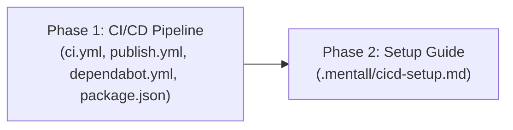

## Overview

Decompose the approved CI/CD design into two implementation phases: (1) all infrastructure files — CI workflow, Publish workflow, Dependabot config, and `package.json` engines field; (2) the local setup guide in Russian. Phase 1 delivers the complete pipeline; Phase 2 delivers maintainer documentation.

## Phase Map

## Phase Summary

| Phase | Name | Type | Dependencies | Complexity | Files |
|-------|------|------|--------------|------------|-------|
| 1 | CI/CD Pipeline | Sequential | None | High | `.github/workflows/ci.yml`, `.github/workflows/publish.yml`, `.github/dependabot.yml`, `package.json` |
| 2 | Setup Guide | Sequential | Phase 1 | Medium | `.mentall/cicd-setup.md` |

## Execution Rules

- Phase 2 depends on Phase 1 — workflow filenames and structure must be finalized before documenting them.
- Every phase must leave the project in a compilable state (`npm run ts-check` passes).
- Phase 1 creates only new files (YAML) plus one field addition in `package.json` — no impact on TypeScript compilation.
- Phase 2 creates a gitignored Markdown file — no impact on compilation.

## Quality Review

### Checklist

| # | Criterion | Status | Notes |
|---|-----------|--------|-------|
| 1 | Every design component mapped to task(s) | PASS | CI workflow → T1.1, Publish workflow → T1.2, Dependabot → T1.3, engines field → T1.4, Setup guide → T2.1. All architecture sections (§§3–7), ADR-1–7, UC-1–4, dataflow §§1–5, docs §7 sections, and all 18 risks are addressed by the corresponding tasks. |
| 2 | File paths concrete and verified | PASS | `.github/` exists; `workflows/` will be created (new). `package.json` verified (exists, `sideEffects` field at L86, `publishConfig` at L87 — Task 1.4 placement is correct). `.mentall` confirmed in `.gitignore` (L7). No placeholder paths. |
| 3 | Phase dependencies correct | PASS | P1 → P2 (linear). Phase 1 Requires: none / Blocks: Phase 2. Phase 2 Requires: Phase 1 / Blocks: none. Mermaid graph matches. No circular dependencies. |
| 4 | Verification criteria per phase | PASS | Phase 1 has 12 verification checkboxes covering YAML validity, trigger structure, SHA pinning, permissions, environment, and job condition. Phase 2 has 6 checkboxes covering file existence, sections, language, links, and gitignore. |
| 5 | Each phase leaves project compilable | PASS | Phase 1: YAML files don't affect TS; `engines` field doesn't affect compilation. Phase 2: gitignored Markdown file. Both phases include `npm run ts-check` as first verification item. |
| 6 | No vague tasks — exact files and changes | PASS | All 5 tasks specify exact file paths, action (Create/Modify), concrete details (trigger YAML, step sequences, permission values, section content). No "improve X" or open-ended tasks. |
| 7 | Design traceability (`[ref: ...]`) on all tasks | PASS | T1.1 → arch §3, §7. T1.2 → arch §4. T1.3 → arch §6. T1.4 → arch §5, ADR-7. T2.1 → 07-docs.md, plus sub-refs to dataflow §4, arch §7, UC-4, UC-3, risks R01/R03/R04/R12. All cross-references valid. |
| 8 | Parallel/sequential correctly marked | PASS | Both phases marked "Sequential" at phase level. Tasks 1.1–1.4 are independent (separate files) and implicitly parallelizable; phase-level sequential marking refers to inter-phase ordering. Acceptable for a single-implementer project. |
| 9 | Complexity estimates present (L/M/H) | FAIL | Phase Summary table has phase-level estimates (Phase 1: High, Phase 2: Medium), but individual tasks (1.1–1.4, 2.1) lack per-task complexity ratings. |
| 10 | Documentation tasks proportional to existing docs/demos | PASS | Existing: `docs/CHANGELOG.md` only, no `apps/demos/`. Plan: single `.mentall/cicd-setup.md` (~50–80 lines), gitignored local maintainer reference. No changes to published docs. Proportional. |
| 11 | Mermaid dependency graph present | PASS | `## Phase Map` contains `flowchart LR` with P1 → P2 relationship. Clear, correct, matches actual dependencies. |
| 12 | Phase summary table complete | PASS | Table includes Phase number, Name, Type, Dependencies, Complexity, and Files columns — all populated for both phases. |

### Documentation Proportionality

Existing documentation is minimal: only `docs/CHANGELOG.md`. No `apps/demos/` directory. The plan proposes a single `.mentall/cicd-setup.md` file (~50–80 lines), which is gitignored — a local maintainer reference, not published documentation. No changes to `README.md`, `docs/`, or any existing documentation files. This is proportional to the feature scope.

### Issues Found

1. **Per-task complexity estimates missing** — Phase Summary table has phase-level complexity (Phase 1: High, Phase 2: Medium), but individual tasks (1.1–1.4 in `01-cicd-pipeline.md`, 2.1 in `02-setup-guide.md`) lack per-task Low/Medium/High complexity estimates. — Expected: each task should have an explicit complexity rating. — Severity: **Medium**

2. **Permissions level inconsistency with design** — Architecture §7 states "Permissions are set at the **job level**, not workflow level, following the principle of least privilege." However, Tasks 1.1 and 1.2 specify "Permissions at workflow level." For single-job workflows this is functionally identical, but the plan contradicts the design's stated approach. — Expected: plan should match design wording ("job level") or note the deviation. — Location: `01-cicd-pipeline.md` Tasks 1.1 and 1.2. — Severity: **Low**

## Next Steps

Proceeds to implementation after human review.
